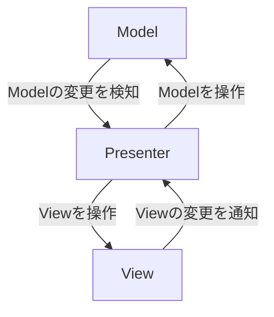

# unity-tutorial-unirx-mv-r-p
This is a project created to learn design patterns, implementing UI using MV(P)R pattern with UniRx.
MV(R)Pの学習の一環で作成したプロジェクトです。
# MV(R)Pパターン  
・主にWeb業界で使われているデザインパターン。クライアントが画面(UI)をよく操作することを前提としたデザインパターン。イベント処理が得意なUniRxと相性が良い。  
  
Model:値を管理  
Presenter:ModelとPresenterを繋ぐ、互いを監視して値を反映する  
View:UI全般。アニメーションもここに書く  

### 便利なイベントとLINQ
| イベント | 説明 |
|:---:|:---:|
|UpdateAsObservable |クリックを待つ |
|ReactiveProperty |値が変化するのを待つ |
|OnClickAsObservable |入力が終わるのを待つ |
|ReactiveCommand |入力が終わるのを待つ |
|ReactiveCommand |入力が終わるのを待つ |
|ReactiveCommand |入力が終わるのを待つ |

| LINQ | 説明 |
|:---:|:---:|
|ThrottleFirst |クリックを待つ |
|Where |値が変化するのを待つ |
|ReactiveCommand |入力が終わるのを待つ |
|ReactiveCommand |入力が終わるのを待つ |
|ReactiveCommand |入力が終わるのを待つ |
|ReactiveCommand |入力が終わるのを待つ |

# おまけ
### ReactiveCommandをUIに応用してみる 
・ReactiveCommandとは...　**処理が可能であるかを制御する機構**   
・ReactiveCommandでトグルなどがTrueだった場合の処理を簡易化(ここではReactiveCommandのExcuteを用いてトグルと連動し、実行可能な状態かどうなのかを通知)。  

## 色々実装してみる
### MV(R)Pパターンを用いたBGMの調整、画像の色調整

### ReactiveCommandを用いたBGM、SEのON、OFF    

### 値を監視する

### 連続防止ボタン

## 参考
https://orotiyamatano.hatenablog.com/entry/2019/08/19/Unity%E3%81%AEMVP%E3%80%81MV(R)P%E3%82%92%E8%AA%BF%E3%81%B9%E3%81%9F%E3%81%91%E3%81%A9%E3%80%81%E3%81%A9%E3%82%8C%E3%81%8C%E6%AD%A3%E3%81%97%E3%81%84%E3%82%93%E3%81%A0%EF%BC%9F   
https://qiita.com/toRisouP/items/5365936fc14c7e7eabf9  
https://www.kadokawa.co.jp/product/302009000670/  
https://www.borndigital.co.jp/book/22432.html  
https://github.com/ryo620org/Padlock  
https://qiita.com/OKsaiyowa/items/745c5359682c7baad6bf  
https://www.hanachiru-blog.com/entry/2019/04/10/175015

## 使用したサウンド
らららコッペパン：https://stsic-bgm.github.io/rarara-koppepan/  
https://soundeffect-lab.info/sound/button/  
