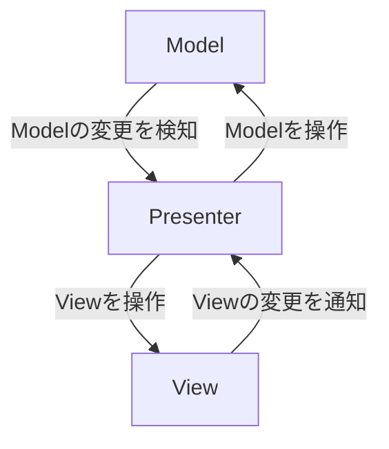

# unity-tutorial-unirx-mv-r-p
This is a project created to learn design patterns, implementing UI using MV(P)R pattern with UniRx.
MV(R)Pの学習の一環で作成したプロジェクトです。
# MV(R)Pパターン  
Web業界で使われているデザインパターン。クライアントが画面(UI)をよく操作することを前提としたデザインパターン。  
  
Model:値を管理  
Presenter:ModelとPresenterを繋ぐ  
View:UI全般。アニメーションもここに書く  

